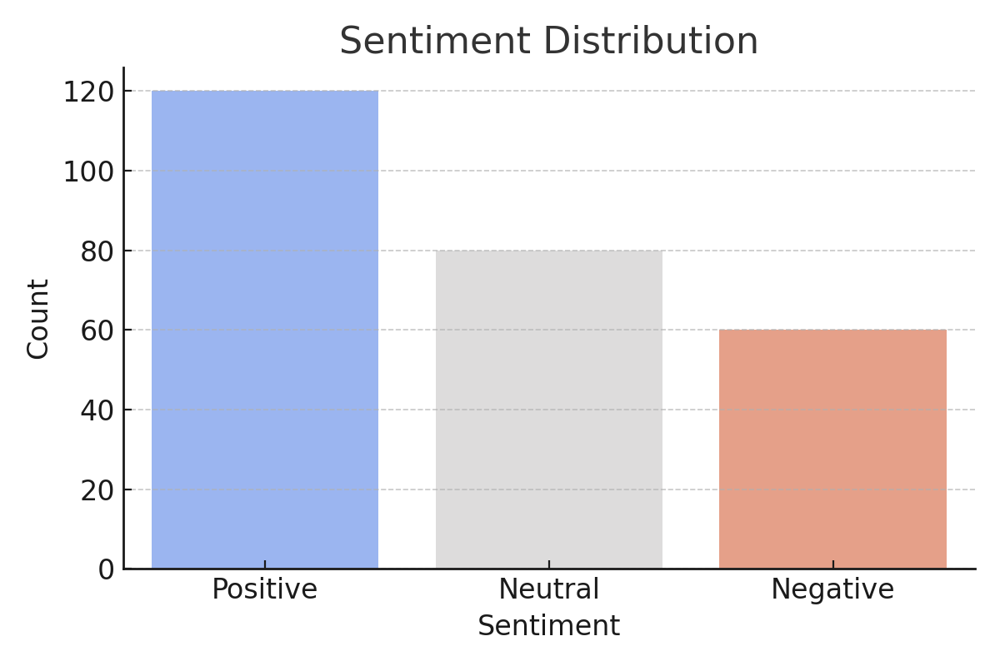
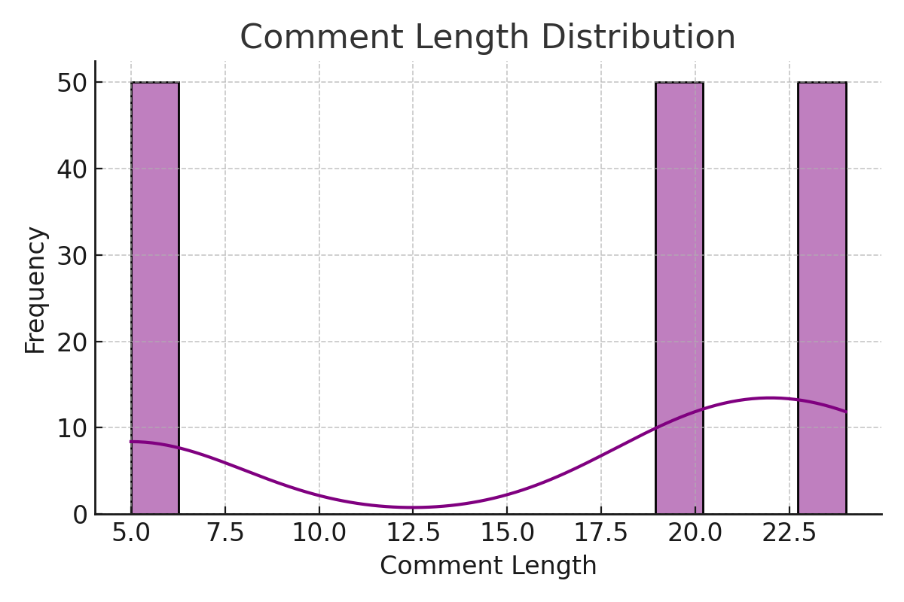

# 📊 Reddit Sentiment Analysis Report

This document provides an overview of the key statistics used to understand and evaluate Reddit posts and comments for sentiment analysis within the **TriggerIQ** system.

---

## 1. 🔎 Sentiment Distribution

This graph shows the distribution of sentiments (e.g., positive, negative, neutral) detected in Reddit posts and their comments.



### **Explanation**
- **Purpose**: Understand the overall mood of the subreddit community.
- **Use**: Gauge the tone of discussions for trend detection or moderation support.
- **Interpretation**: Peaks in negative sentiment may indicate user frustration or heated topics.

---

## 2. 📝 Comment Length Distribution

This histogram visualizes the lengths of comments analyzed.



### **Explanation**
- **Purpose**: Understand user engagement levels through verbosity.
- **Use**: Detect spam (e.g., very short comments) or deep discussions (long comments).
- **Interpretation**: A bimodal shape might reflect a mix of casual and in-depth comments.

---

## 3. 📌 Additional Filters Applied

- **Subreddit**: The subreddit name (e.g., `r/technology`)
- **Keywords**: Optional word filters used to match posts or comments
- **Authors**: Specific Reddit usernames being tracked
- **Date Range**: Only posts within a start and end time window are used
- **Minimum Upvotes**: Posts below this threshold are ignored to avoid low-signal content

---

## 4. ✅ Filtering Pipeline Overview

```mermaid
graph TD
    A[Fetch Top Posts] --> B[Filter by Upvotes & Date]
    B --> C[Match Keywords in Title/Comments]
    C --> D[Match Author (Optional)]
    D --> E[Keep Post with Matching Comments or Title]
```

---

## 5. 📁 Files & Visuals

| File                          | Description                     |
|-------------------------------|---------------------------------|
| sentiment_distribution.png    | Bar chart of sentiment types    |
| comment_length_distribution.png | Histogram of comment lengths |
| reddit_sentiment_report.md    | This Markdown report            |

---

*Created by: TriggerIQ Sentiment Module*
